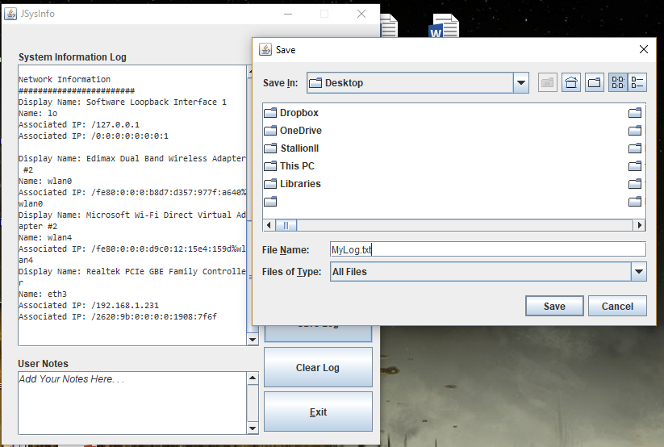
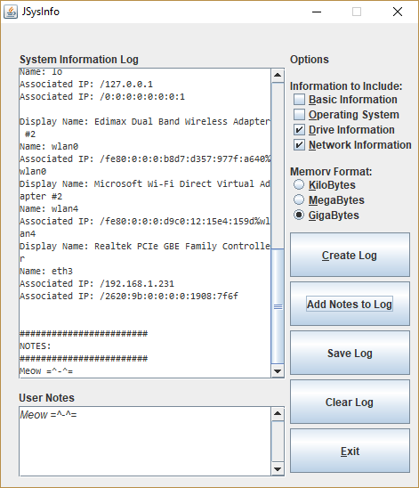

# JSysInfo

 

A Java GUI program that displays user specified information about the machine that the program is running on.

***

## Breakdown

- JSysInfo.java is the front end program GUI
- SystemInfo.java is the program backend the retrieves computer information and sends it to be displayed by JSysInfo.java

## Screenshots

*Written by Matthew Carney [matthewcarney64@gmail.com] =^-^=*
